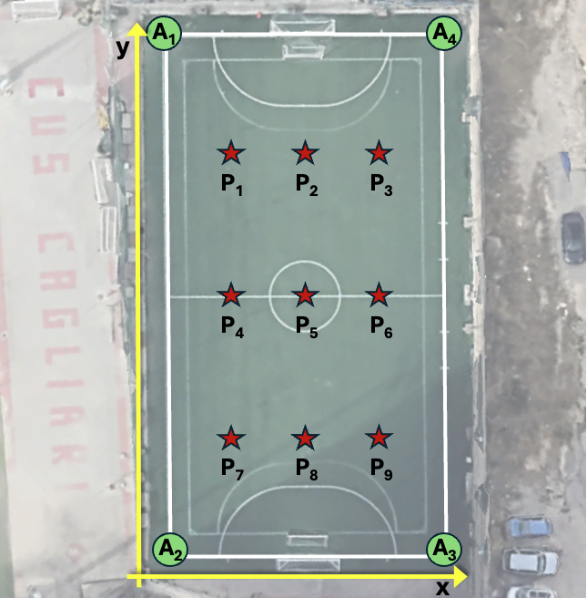

# Dataset: Radio Fingerprinting

## Experimental Scenario
This dataset was collected at the CUS sports citadel in Cagliari, Italy. The experiment involved placing the Access Point (AP) at 9 different predefined positions within the sports field while the client nodes remained associated. The primary objective is to correlate physical and MAC layer metrics with specific spatial coordinates for radio fingerprinting-based localization techniques.

<figure>
  
  <figcaption>Figure 1: Experimental setup for WiFi HaLow fingerprinting measurements.</figcaption>
</figure>

## Coordinate Mapping
The following tables define the spatial mapping (in meters). The coordinate system is **relative to Anchor A2**, which is set at the origin **(0, 0)**.

### Anchor Positions
| Anchor ID | X (m) | Y (m) |
| :--- | :--- | :--- |
| A1 | 0 | 44 |
| A2 | 0 | 0 |
| A3 | 23.5 | 0 |
| A4 | 23.5 | 44 |

### Target Positions
| Position ID | X (m) | Y (m) |
| :--- | :--- | :--- |
| P1 | 6 | 34 |
| P2 | 11.75 | 34 |
| P3 | 17.5 | 34 |
| P4 | 6 | 22 |
| P5 | 11.75 | 22 |
| P6 | 17.5 | 22 |
| P7 | 6 | 10 |
| P8 | 11.75 | 10 |
| P9 | 17.5 | 10 |

## Data Acquisition
- **Sampling Frequency:** 1 Hz (1 measurement per second).
- **Duration:** 10 minutes of continuous data collection for each of the 9 positions.
- **Data Cleaning:** Outliers removed using a 1st–99th percentile filter.
- **Files:** `Position_1.csv` to `Position_9.csv` contain the post-processed radio metrics.

## Data Structure
The CSV files use a semicolon (`;`) as a delimiter. Each record contains the following metrics collected from 4 different Access Points (AP):

| Column Name   | Description                                        |
|:--------------|:---------------------------------------------------|
| `position_id` | Identifier of the Access Point position (1 to 9)   |
| `RSSI_Ax`     | Received Signal Strength Indicator for A *x* (dBm) |
| `SNR_Ax`      | Signal-to-Noise Ratio for A *x* (dB)               |
| `MCS_Ax`      | Modulation and Coding Scheme for A *x*             |

*Note: The metrics (`RSSI`, `SNR`, `MCS`) are provided for 4 distinct Access Points (A1 to A4).*