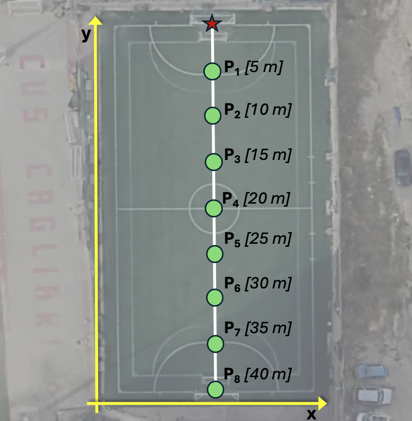

# Dataset: Linear Propagation Analysis

## Experimental Scenario
This dataset was collected at the CUS sports citadel in Cagliari, Italy, in an outdoor environment. The target node remained stationary while the anchor was moved along a straight line at incremental distances (from 5m to 40m). This setup allows for the characterization of RSSI behavior in Line of Sight (LOS) conditions.

<figure>
  
  <figcaption>Figure 1: Experimental setup for linear propagation measurements.</figcaption>
</figure>

## Technical Details
- **Devices:** Raspberry Pi 4 Model B equipped with ALFA AHPI7292S (Newracom NRC7292 chipset) WiFi HaLow modules.
- **Configuration:** Line of Sight (LOS).
- **Data Cleaning:** Outliers removed using a 1st–99th percentile filter.
- **Files:** `Linear.csv` contain RSSI measurements (in dBm).

## Data Structure
The `Linear.csv` file uses a semicolon (`;`) as a delimiter. Each column represents the RSSI measurements (in dBm) collected at a specific distance from the anchor:

| Column Name | Description |
| :--- | :--- |
| `RSSI_5meters` | RSSI measurement at 5 meters |
| `RSSI_10meters` | RSSI measurement at 10 meters |
| `RSSI_15meters` | RSSI measurement at 15 meters |
| `RSSI_20meters` | RSSI measurement at 20 meters |
| `RSSI_25meters` | RSSI measurement at 25 meters |
| `RSSI_30meters` | RSSI measurement at 30 meters |
| `RSSI_35meters` | RSSI measurement at 35 meters |
| `RSSI_40meters` | RSSI measurement at 40 meters |